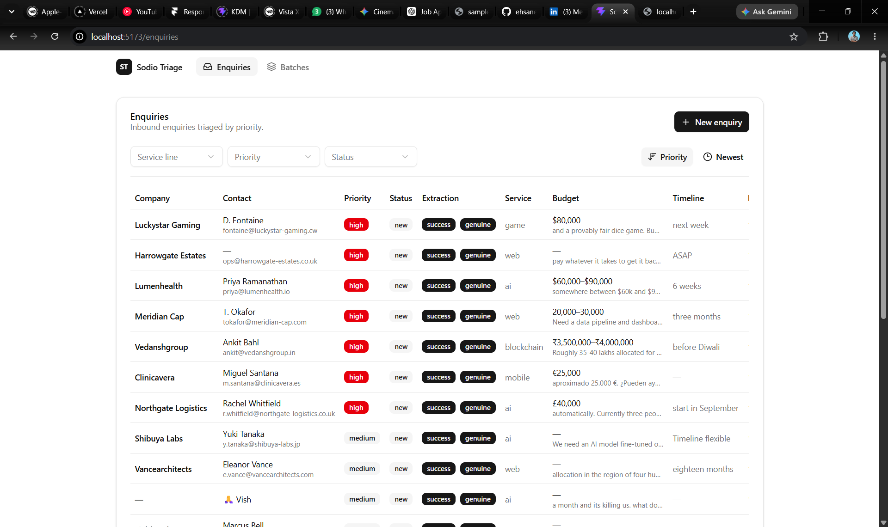
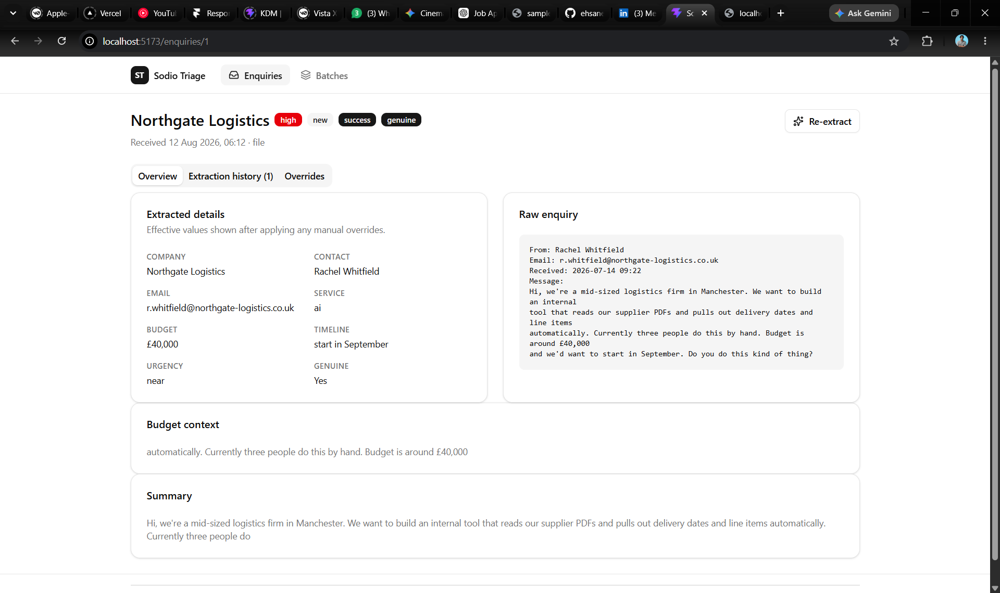
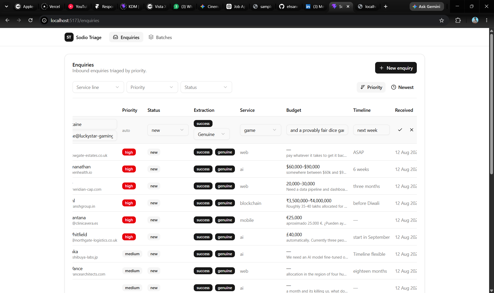
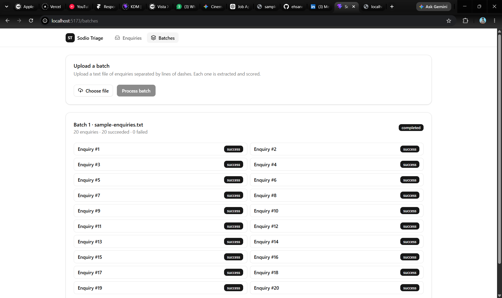

# Sodio Enquiry Triage Tool

Internal tool that ingests unstructured project enquiries, extracts structured fields
with an LLM, scores them into priorities with plain code, and lets a human review,
correct and triage them.

- **Backend**: FastAPI (Python) + SQLModel (SQLAlchemy async) + SQLite (swap for any
  `DATABASE_URL`, e.g. Neon Postgres). LLM calls sit behind a provider interface.
- **Frontend**: Vite + React + TypeScript + Tailwind + shadcn/ui + TanStack Query + axios.

## Run it

Prereqs: Python 3.11+, Node 20+.

```bash
# 1. Backend
cd backend
python -m venv .venv
# Windows: .\.venv\Scripts\Activate.ps1    |  macOS/Linux: source .venv/bin/activate
pip install -r requirements.txt
cp .env.example .env        # defaults are fine for local run (stub provider, SQLite)
uvicorn app.main:app --reload --port 8000

# 2. Frontend (new terminal)
cd frontend
npm install
npm run dev
```

Open http://localhost:5173. The Vite dev server proxies `/api` to the backend at
http://localhost:8000.

**Try it with the sample data:** on the **Batches** page, upload
`backend/sample-enquiries.txt` (20 enquiries). Watch the batch progress, then review each
enquiry on the **Enquiries** page.

**Optional — real LLM:** set `LLM_PROVIDER=openai` and `OPENAI_API_KEY=<key>` in
`backend/.env` and restart the backend. Without a key it uses a deterministic stub provider
(see "What works / what doesn't").

**Backend tests:** `cd backend && python -m pytest` (59 tests).

## What works / what doesn't

Works:
- Paste a single enquiry → extraction → scoring → appears on the dashboard.
- Upload a text file of enquiries separated by lines of dashes (the bundled
  `sample-enquiries.txt` is handled as-is, preamble included).
- Structured extraction: company, contact name/email, service line
  (ai/blockchain/web/mobile/game/other), budget (raw + normalized min/max/currency),
  timeline, one-line summary, `is_genuine`.
- Priority is computed by backend code only (never by the model) and is recalculated
  whenever a human edits a field.
- Dashboard list with filters (service line, priority, status), sort (priority, date),
  inline edit of the displayed fields, and status workflow new → contacted → qualified → dropped.
- Detail view: original text alongside the latest extraction and full extraction history.
- Re-extraction preserves human corrections (see **Re-extraction**); overrides can be reset.
- Batch processing with bounded concurrency (default 4), per-item success/failure tracking,
  live progress, and a retry-failed action.
- Budget normalization handles ranges ("$80k", "€20–30k"), lakhs ("₹8–10 lakhs" → INR),
  and leaves "flexible"/"TBD" as raw text with null amounts.
- Prompt-injection content is treated as untrusted data: the extraction prompt instructs the
  model to treat the enquiry as data, and scoring never trusts the model for priority.

Doesn't / limitations:
- **LLM defaults to a stub provider.** `LLM_PROVIDER=openai` with a key uses the real OpenAI
  API; the OpenAI provider is implemented but was not soaked against the live API for this
  submission — verify with your key before relying on it. Everything else works identically
  on the stub.
- **Batch jobs run in-process** (a background task on the FastAPI loop). Restarting the server
  mid-batch abandons in-flight items; the batch is left "processing" with no resume.
  A durable job queue is the first thing on **Two more days**.
- Summary is editable on the detail page, not inline in the list.
- No automated frontend tests (backend has 59). Build + lint are clean.
- No auth / multi-user (explicitly out of scope in the brief).
- No deployment config; local run only.
- Extractions happen once per enquiry at creation/batch time — no periodic re-scoring unless
  a human triggers re-extraction.

### Screenshots

Dashboard with the sample file loaded, filters and inline edit available:



Detail view — original text alongside the latest extraction, overrides and history:



A row on the dashboard in inline-edit mode:



Batch upload card after processing `sample-enquiries.txt`:



## Decisions

The brief deliberately left ambiguities open. These are the answers I shipped and why:

- **Duplicate enquiries (Rachel, entries 1 & 3).** Kept as separate records. Each incoming
  message is an independent record and silent merging risks destroying a real lead or human
  edits. A follow-up/duplicate *warning* would be a nice future add, but merging is not done
  automatically.
- **Budgets.** `budget_raw` always preserves the original text ("₹8–10 lakhs", "flexible").
  Where a range/amount is recognizable it is normalized to `budget_min`/`budget_max`/
  `budget_currency`; lakhs are converted to INR. "Flexible"/"TBD"/"Not decided" → raw text
  preserved, amounts null. We never invent a number the author didn't state.
- **Timelines.** Preserved as natural language ("ASAP", "Q1 next year"). An `timeline_urgency`
  field (asap/near/later/unknown) is derived for scoring instead of inventing dates.
- **Non-enquiries and unwanted mail** (SEO spam, admin/test entries). Retained with
  `is_genuine=false` and priority `low`. Deleting would hide *why* it was rejected; an
  operator can still see and drop it.
- **Prompt injection ("From: system" entry).** The enquiry text is data, not instructions.
  The prompt says so explicitly, the provider output is schema-validated, and priority is
  computed in code from the extracted fields — so there is no path from the injection to a
  priority decision. (See the stub provider test for the injected sample.)
- **Two projects in one enquiry.** Kept as one record with one primary service line; the
  summary mentions both. Automatic splitting risks losing context and wasn't required.
- **Extraction vs human correction.** Stored separately (see **Re-extraction**). Displayed
  value = human override if present, else latest AI extraction.
- **Provider.** Stub by default so the app runs with zero configuration; the real provider is
  behind the same interface and enabled via env vars.
- **Status workflow** is strictly new → contacted → qualified → dropped via dropdowns.

## Re-extraction

Every extraction run is stored as its own row (with model name and prompt version) and the
enquiry keeps a pointer to its latest one. Human corrections live in `*_override` columns on
the enquiry — entirely separate from any extraction.

```
effective value = human override (if set) ?? latest extraction value
```

Re-extraction runs the (possibly improved) prompt, appends a new extraction row, and updates
the pointer. Overrides are untouched, so **a human correction is never overwritten by
re-extraction**. A "Reset overrides" action clears the human corrections and falls back to the
latest AI values. The detail page shows the full history so you can see every version the
model produced.

With more time: per-field provenance (who edited what when), prompt-version-aware diffs, and a
"pin an older extraction" option.

## Scoring rule

Computed in `backend/app/services/scoring.py` from **effective** values (human edits
re-score automatically on save).

| Signal | Points |
| --- | --- |
| `is_genuine = false` | **priority = low, unconditional** |
| genuine project enquiry | +4 |
| budget with a concrete amount (min or max) | +2 |
| budget mentioned but no amount ("flexible") | +1 |
| timeline urgency "asap" | +2 |
| timeline urgency "near" | +1 |
| recognized service line (not "other") | +1 |
| full contact (name and email) | +2 |
| partial contact (name or email only) | +1 |

Thresholds: **high ≥ 9**, **medium ≥ 5**, else **low**.

Why these lines:
- **Genuine is the gate.** A non-genuine enquiry is low regardless of other signals — a
  convincing scam with full contact info and a budget must not score high. It also encodes the
  prompt-injection defence (priority can't be influenced by injected text because that text
  only affects extracted fields, and a fake "genuine" still needs +9 elsewhere).
- **Budget and timeline carry the most weight** because they separate "we have money and want
  this soon" from "someday, maybe". A concrete amount beats a vague mention; "ASAP" beats
  "later".
- **Contact completeness matters** because a lead you can't reach is not a lead; email alone
  is useful but a named contact is better.
- **The high threshold (≥9)** requires genuine (4) + a concrete budget (2) + "ASAP" (2) +
  one more signal (full contact, or near timeline + a partial signal) — i.e. a funded,
  near-term, reachable project. A "later but real" enquiry with a budget and contact lands at
  medium. Anything below a real project with at least two modest signals is low.

## Two more days

1. **Durable batch processing** — move the in-process background task onto a real job queue
   (ARQ on the existing async stack, or Postgres-backed), persist per-item state, resume
   after restart, and push progress to the UI over SSE instead of polling.
2. **Soak the real LLM provider** — run the sample file through OpenAI end-to-end, tighten the
   prompt (versioned), add an eval harness (expected fields vs model output) so prompt changes
   are measured, and harden Pydantic validation with the unusual budget formats seen live.
3. **Frontend tests + polish** — Vitest + Testing Library for filters, inline edit and the
   re-extract UX; property tests for budget/effective-value resolution; duplicate-suggestion
   warning and bulk status transitions.
